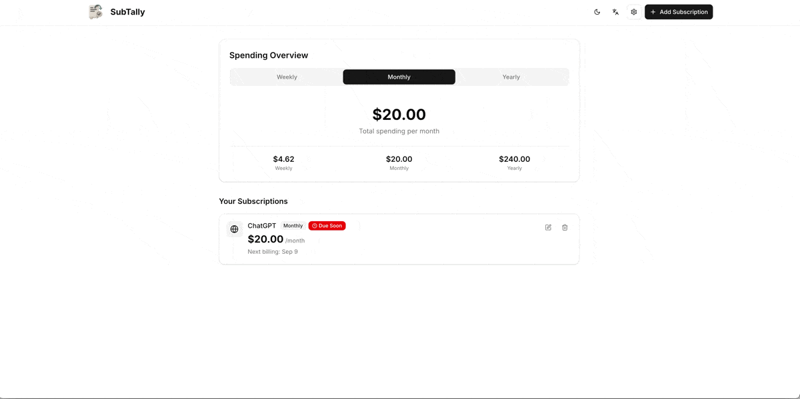
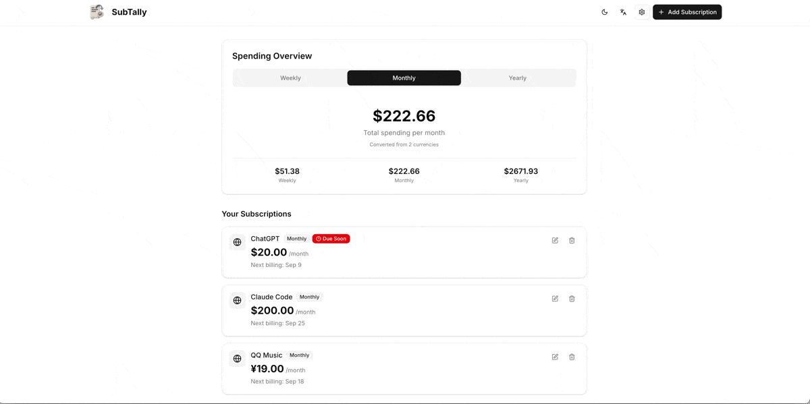
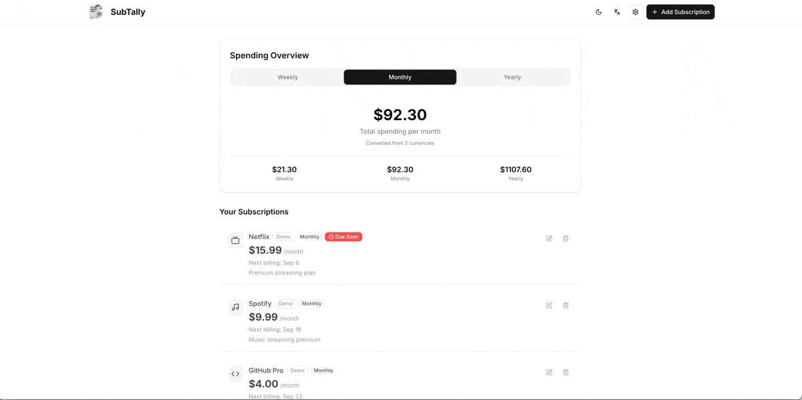

# SubTally 📊


[](https://nextjs.org/)
[](https://react.dev/)
[](https://www.typescriptlang.org/)
[](https://tailwindcss.com/)

A privacy-first subscription tracker that helps you manage and monitor your recurring subscriptions. Built with Next.js 15, React 19, and TypeScript.

[中文文档](./README.zh.md) | [English](./README.md)

## 🚀 Quick Deploy

[](https://vercel.com/new/clone?repository-url=https%3A%2F%2Fgithub.com%2FLihaoWang%2FSubTally)

## ✨ Features

- **🎨 Minimal Design**: Clean, intuitive interface focused on essential functionality
- **💱 Multi-Currency Support**: Track subscriptions in different currencies with exchange rate conversion
- **📤 Import/Export**: JSON-based backup and restore functionality for easy data migration
- **🔓 Open Source & Self-Hostable**: Fully open source with the ability to self-host on your own infrastructure
- **🌗 Dark/Light Mode**: Toggle between themes with automatic system preference detection
- **🌍 Multi-Language Support**: Full English and Chinese localization with browser language detection
- **📱 Responsive Design**: Works seamlessly across desktop, tablet, and mobile devices
- **🔒 Privacy-First**: All data stored locally in your browser - no external APIs or databases required
- **⏰ Flexible Periods**: Track weekly, monthly, and yearly subscriptions with smart billing reminders

## 🎥 Feature Demos

- Add Subscriptions: Quickly add new subscriptions with name, price, currency, period, and next billing date.

  

- Base Currency: Change your base currency to view normalized totals and conversions.

  

- Import/Export: Backup and restore your data via JSON files.

  

- Language Switch: Toggle between English and Chinese with instant UI updates.

  

- Theme Toggle: Switch between light and dark themes; follows system preference.

  

## 🚀 Getting Started

### Prerequisites

- Node.js (version 18+)
- pnpm

### Installation

```bash
# Clone the repository
git clone https://github.com/LihaoWang/SubTally
cd SubTally

# Install dependencies
pnpm install

# Start development server
pnpm dev
```

Visit `http://localhost:3000` to view the application.

## 📋 Available Scripts

- `pnpm dev` - Start development server
- `pnpm build` - Build for production
- `pnpm start` - Start production server
- `pnpm lint` - Run ESLint

## 🏗️ Tech Stack

- **Framework**: Next.js 15 with App Router
- **Frontend**: React 19, TypeScript
- **Styling**: Tailwind CSS v4
- **UI Components**: Radix UI primitives with shadcn/ui
- **Forms**: React Hook Form with Zod validation
- **Icons**: Lucide React
- **Theme**: next-themes

## 📁 Project Structure

```
├── app/                    # Next.js app router pages
├── components/             # Reusable UI components
│   ├── ui/                # shadcn/ui components
│   └── ...                # Feature components
├── contexts/              # React context providers
├── lib/                   # Utility functions and configurations
├── hooks/                 # Custom React hooks
└── public/                # Static assets
```

## 🌍 Internationalization

The app supports English and Chinese with automatic browser language detection. Translations are managed through the `lib/i18n.ts` system with nested keys and parameter substitution.

## 🎨 Theming

Built-in light and dark mode support with system preference detection. Themes persist across sessions using localStorage.

## 🤝 Contributing

1. Fork the repository
2. Create your feature branch (`git checkout -b feature/amazing-feature`)
3. Commit your changes (`git commit -m 'Add amazing feature'`)
4. Push to the branch (`git push origin feature/amazing-feature`)
5. Open a Pull Request

## 📄 License

This project is licensed under the [MIT License](https://opensource.org/licenses/MIT).
