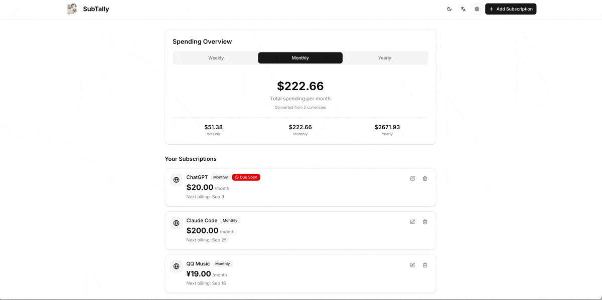
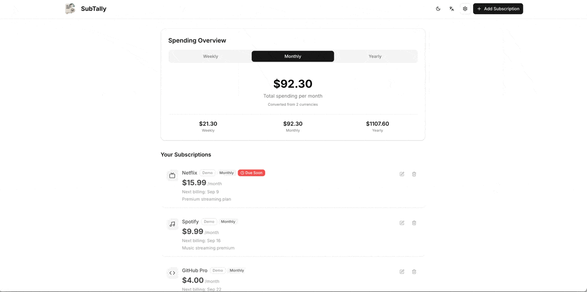

# SubTally 📊


[](https://nextjs.org/)
[](https://react.dev/)
[](https://www.typescriptlang.org/)
[](https://tailwindcss.com/)

隐私优先的订阅跟踪应用，帮助您管理和监控定期订阅。使用 Next.js 15、React 19 和 TypeScript 构建。

[中文文档](./README.zh.md) | [English](./README.md)

## 🚀 快速部署

[](https://vercel.com/new/clone?repository-url=https%3A%2F%2Fgithub.com%2FLihaoWang%2FSubTally)

## ✨ 功能特性

- **🎨 极简设计**：简洁直观的界面，专注于核心功能
- **💱 多货币支持**：支持不同货币跟踪订阅，包含汇率转换功能
- **📤 导入导出**：基于 JSON 的备份和恢复功能，便于数据迁移
- **🔓 开源自部署**：完全开源，支持在自己的基础设施上自部署
- **🌗 深浅主题**：支持主题切换，自动检测系统偏好设置
- **🌍 多语言支持**：完整的中英文本地化，支持浏览器语言检测
- **📱 响应式设计**：在桌面、平板和移动设备上完美运行
- **🔒 隐私优先**：所有数据本地存储在浏览器中，无需外部 API 或数据库
- **⏰灵活周期**：支持每周、每月和每年订阅跟踪，智能账单提醒

## 🎥 功能演示

- 添加订阅：快速添加订阅，支持名称、价格、货币、周期和下一次扣费日期。

  

- 基础货币：切换基础货币以查看统一汇总与自动换算。

  

- 导入/导出：通过 JSON 文件备份和恢复数据。

  

- 语言切换：中英文即时切换，界面实时更新。

  

- 主题切换：浅色/深色主题一键切换，支持跟随系统。

  

## 🚀 开始使用

### 环境要求

- Node.js (版本 18+)
- pnpm

### 安装步骤

```bash
# 克隆仓库
git clone https://github.com/LihaoWang/SubTally
cd SubTally

# 安装依赖
pnpm install

# 启动开发服务器
pnpm dev
```

访问 `http://localhost:3000` 查看应用。

## 📋 可用脚本

- `pnpm dev` - 启动开发服务器
- `pnpm build` - 构建生产版本
- `pnpm start` - 启动生产服务器
- `pnpm lint` - 运行 ESLint

## 🏗️ 技术栈

- **框架**：Next.js 15 with App Router
- **前端**：React 19, TypeScript
- **样式**：Tailwind CSS v4
- **UI 组件**：Radix UI primitives with shadcn/ui
- **表单**：React Hook Form with Zod 验证
- **图标**：Lucide React
- **主题**：next-themes

## 📁 项目结构

```
├── app/                    # Next.js app router 页面
├── components/             # 可复用 UI 组件
│   ├── ui/                # shadcn/ui 组件
│   └── ...                # 功能组件
├── contexts/              # React context 提供者
├── lib/                   # 工具函数和配置
├── hooks/                 # 自定义 React hooks
└── public/                # 静态资源
```

## 🌍 国际化

应用支持中英文，具有自动浏览器语言检测功能。翻译通过 `lib/i18n.ts` 系统管理，支持嵌套键和参数替换。

## 🎨 主题

内置浅色和深色模式支持，具有系统偏好检测。主题使用 localStorage 在会话间持久化。

## 🤝 贡献

1. Fork 仓库
2. 创建您的功能分支 (`git checkout -b feature/amazing-feature`)
3. 提交您的更改 (`git commit -m 'Add amazing feature'`)
4. 推送到分支 (`git push origin feature/amazing-feature`)
5. 打开 Pull Request

## 📄 许可证

此项目为私有项目。
